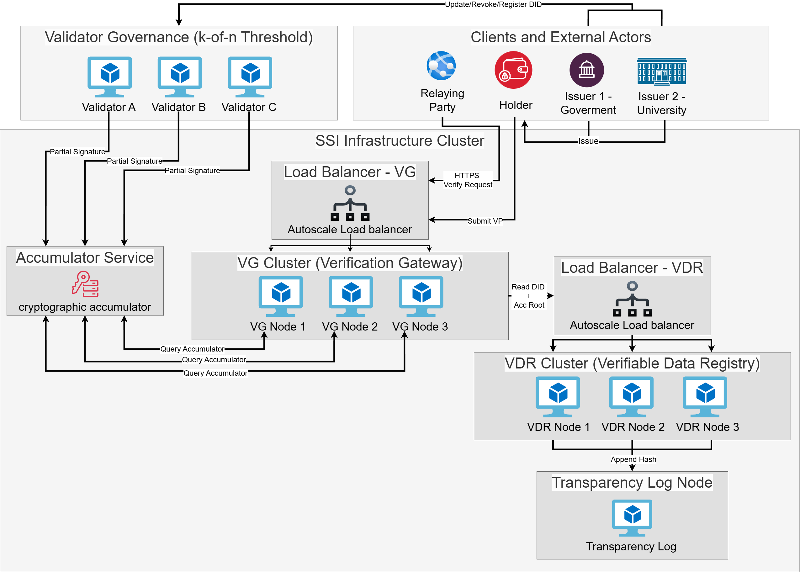

# SSI Revocation Protocol with Threshold Governance

**Arsitektur Terdesentralisasi untuk Self-Sovereign Identity (SSI) dengan Mekanisme Pencegahan Manipulasi**

Sebuah *proof-of-concept* (PoC) implementasi protokol pencabutan (revocation) identitas digital terdesentralisasi (Self-Sovereign Identity / SSI) yang menggunakan **Threshold Governance** dan Immutable Audit Logs (via **Sigstore Trillian/Rekor**). Proyek ini dirancang untuk mencegah pencabutan sepihak (tamper-prevention) oleh entitas tunggal. Sistem ini dibangun di atas orkestrasi **Kubernetes** dan mengintegrasikan standar keamanan industri seperti **RBAC**, **Distributed Rate Limiting**, **Threshold Signatures**, dan **Immutable Audit Logs**.

## ✨ Fitur Utama

### 1. Security & Tamper-Prevention
* **Threshold Governance (k-of-n):** Mencegah *single point of compromise*. Pencabutan kredensial (Revocation) memerlukan tanda tangan kriptografi (Ed25519) dari $k$ validator independen sebelum ditulis ke Ledger.
* **Immutable Audit Trail:** Setiap verifikasi sukses dicatat ke dalam **Transparency Log** (berbasis Merkle Tree via Trillian/Rekor) untuk memastikan sejarah verifikasi tidak dapat diubah diam-diam.
* **Zero-Zero Trust Network:** Komunikasi antar layanan dibatasi menggunakan **Kubernetes NetworkPolicies**. Hanya jalur spesifik (misal: Governance -> Issuer) yang diizinkan.
* **Secret Management:** Kredensial sensitif (Wallet Keys, DB Passwords, JWT Secrets) disuntikkan secara aman melalui Kubernetes Secrets, bukan hardcoded.

### 2. Performance & Reliability
* **Auto-Scaling (HPA):** Layanan *Verification Gateway* dan *Issuer Agent* secara otomatis menambah jumlah replika (Pods) saat penggunaan CPU meningkat >60%.
* **Distributed Rate Limiting:** Menggunakan **Redis** untuk menyinkronkan kuota *rate limit* di seluruh replika pod. Mencegah serangan DoS (Denial of Service) global.
* **Graceful Shutdown:** Menangani sinyal `SIGTERM` dari Kubernetes untuk menutup koneksi database dan menyelesaikan request aktif sebelum pod dimatikan.

### 3. Privacy Preservation
* **Verifiable Credentials & ZKP:** Verifikasi dilakukan tanpa pertukaran data mentah, menggunakan protokol *Present Proof* dari Hyperledger Aries.
* **Sanitized Errors:** Respons API ke klien dibersihkan dari *stack trace* sensitif untuk mencegah *information leakage*.

## 📂 Struktur Proyek

```
ssi-production-kit/
│
├── k8s/                        # Infrastruktur Kubernetes (Manifests)
│   └── deployment.yaml         # Definisi lengkap: Deployments, Services, HPA, Secrets, NetworkPolicies
│
├── src/
│   ├── governance-service/     # Layanan Gatekeeper (Threshold Logic)
│   │   ├── index.js            # Logika utama: Ed25519 Verify, Redis State, JWT Auth
│   │   ├── package.json        # Dependencies: helmet, redis, express
│   │   └── Dockerfile          # Definisi Container Image
│   │
│   └── verification-gateway/   # Middleware Verifikasi & Audit
│       ├── index.js            # Logika utama: Rate Limiting, Input Validation, Trillian Log
│       ├── package.json        # Dependencies: express-validator, rate-limit-redis
│       └── Dockerfile          # Definisi Container Image
│
└── README.md                   # Dokumentasi
```

## 🏛️ Arsitektur Sistem



### Komponen Utama & Teknologi

1.  **VDR (Verifiable Data Registry)**: Menggunakan **Hyperledger Indy** yang dideploy secara lokal via **VON-Network**.
2.  **Identity Agents**: Menggunakan **Aries Cloud Agent Python (ACA-Py)** untuk peran **Issuer** dan **Verifier**.
3.  **Governance Service (Tamper Prevention)**: Layanan Node.js kustom yang mengimplementasikan **Threshold Signatures (k-of-n)**. Mencegah manipulasi pencabutan kredensial (Revocation) oleh admin tunggal.
4.  **Verification Gateway**: Middleware Node.js yang menangani verifikasi kredensial, **Distributed Rate Limiting** (via **Redis**), dan pencatatan audit trail.
5.  **Transparency Log**: Menggunakan **Sigstore Trillian** & **Rekor** untuk menyediakan log audit yang **Immutable** (tidak dapat diubah) berbasis Merkle Tree.
6.  **Databases**: 
    *   **PostgreSQL**: Penyimpanan Wallet untuk ACA-Py.
    *   **MySQL 8.0**: Penyimpanan data Merkle Tree untuk Trillian.
    *   **Redis**: State management untuk Rate Limiting dan Governance quorum.

## 🗺️ Pemetaan Arsitektur (Architecture Mapping)

| Komponen Konseptual | Teknologi / Implementasi | Lokasi / Namespace | Port |
| :--- | :--- | :--- | :--- |
| **VDR (Ledger)** | Hyperledger Indy (VON) | External (Docker Host) | 9000 (Web), 9701-9708 |
| **Issuer Agent** | ACA-Py (Government Issuer) | `ssi-network/issuer-agent` | 8000 (CDTP), 8001 (Admin) |
| **Verifier Agent** | ACA-Py (Sidecar) | `ssi-network/verification-gateway` | 8020 (CDTP), 8021 (Admin) |
| **Tamper Prevention** | Governance Service | `ssi-network/governance-service` | 3000 |
| **Verification Logic** | Verification Gateway | `ssi-network/verification-gateway` | 4000 |
| **Transparency Log** | Rekor Server | `ssi-network/rekor-server` | 3000 |
| **Log Backend** | Trillian Log Server | `ssi-network/trillian-log-server` | 8090 (HTTP), 8091 (gRPC) |
| **Immutable Storage** | MySQL 8.0 | `ssi-network/trillian-mysql` | 3306 |

## 🏗️ Cara Menjalankan (Setup Guide)

### 1. Prasyarat
*   **Docker Desktop** (dengan Kubernetes diaktifkan).
*   **kubectl** CLI.
*   **Git** & **Python 3**.

### 2. Setup Local Indy Ledger (VON-Network)
Sistem memerlukan jaringan Indy yang berjalan. Kita menggunakan `von-network` untuk simulasi lokal.

```powershell
# Jalankan di directory di luar repository ini
git clone https://github.com/bcgov/von-network.git
cd von-network
./manage build
./manage start
```
*Pastikan Web UI dapat diakses di `http://localhost:9000`.*

### 3. Build & Deploy SSI Kit
1.  **Build Local Images** (Jika ada perubahan script):
    ```powershell
    # Governance Service
    cd src/governance-service
    docker build -t dn06/ssi:governance-service-v1 .
    
    # Verification Gateway
    cd ../verification-gateway
    docker build -t dn06/ssi:gateway-middleware-v1 .
    ```

2.  **Deploy ke Kubernetes**:
    ```powershell
    # Kembali ke root project
    kubectl apply -f k8s-deployment.yaml
    ```

### 4. Verifikasi Status
Pastikan semua pod berstatus `Running`:
```powershell
kubectl get pods -n ssi-network
```

## 🧪 Skenario Pengujian (Step-by-Step)

### A. Mekanisme Threshold Revocation (Admin)
Mencegah manipulasi hapus/cabut ijazah secara sepihak.

**Langkah 1: Ajukan Proposal (Butuh JWT Admin)**
```bash
# Ganti <JWT_ADMIN_TOKEN> dengan token valid
curl -X POST http://localhost:3000/proposals \
  -H "Authorization: Bearer <JWT_ADMIN_TOKEN>" \
  -H "Content-Type: application/json" \
  -d '{
    "action": "REVOKE_CREDENTIAL",
    "payload": { "cred_rev_id": "1", "rev_reg_id": "RR-123" }
  }'
```
*Output: `{"proposalId": "uuid-123...", "status": "PENDING"}`*

**Langkah 2: Voting Validator (Threshold Security)**
Validator harus memberikan persetujuan kriptografi. Ulangi untuk 3 validator berbeda.
```bash
curl -X POST http://localhost:3000/proposals/<PROPOSAL_ID>/approve \
  -H "Content-Type: application/json" \
  -d '{
    "validatorId": "validator_1",
    "signature": "<ED25519_SIGNATURE>"
  }'
```
> **Hasil:** Setelah quorum tercapai (misal 3 dari 5), Governance Service otomatis memanggil Issuer Agent untuk menulis ke Ledger.

### B. Verifikasi Aman & Audit Trail (Verifier)

**Langkah 1: Kirim Permintaan Verifikasi**
```bash
curl -X POST http://localhost:4000/verify \
  -H "Authorization: Bearer <JWT_VERIFIER_TOKEN>" \
  -H "Content-Type: application/json" \
  -d '{
    "proof_request_data": {
      "name": "Check Degree",
      "version": "1.0",
      "requested_attributes": {
        "attr1_referent": { "name": "degree", "restrictions": [] }
      }
    }
  }'
```

**Langkah 2: Cek Log Audit di Rekor (Transparency Log)**
Anda bisa memverifikasi bahwa bukti audit telah dicatat secara permanen:
```bash
# Akses API Rekor secara langsung untuk melihat entri log
curl http://localhost:3000/api/v1/log/entries?logIndex=0
```

## 🛡️ Keamanan & Privasi
*   **RBAC & Network Policies**: Isolasi trafik antar pod.
*   **Secret Management**: Wallet keys disimpan sebagai K8s Secrets.
*   **Zero-Knowledge Proofs**: Privasi Holder tetap terjaga melalui standar Hyperledger Aries.

---
*Project ini adalah tugas akhir untuk program sarjana Teknik Informatika, Institut Teknologi Sepuluh Nopember, Surabaya.*