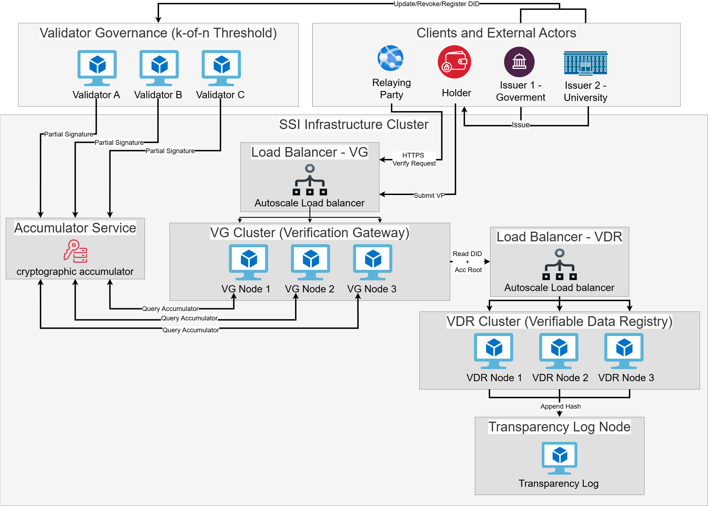

# Production-Grade SSI Implementation Kit

**Arsitektur Terdesentralisasi untuk Self-Sovereign Identity (SSI) dengan Mekanisme Pencegahan Manipulasi**

Repository ini berisi implementasi teknis lengkap ( *Artifacts* ) untuk Tugas Akhir mengenai sistem SSI yang tahan manipulasi. Sistem ini dibangun di atas orkestrasi **Kubernetes** dan mengintegrasikan standar keamanan industri seperti  **RBAC** ,  **Distributed Rate Limiting** ,  **Threshold Signatures** , dan  **Immutable Audit Logs** .

## Fitur Utama

### 1. Security & Tamper-Prevention

* **Threshold Governance (k-of-n):** Mencegah  *single point of compromise* . Pencabutan kredensial (Revocation) memerlukan tanda tangan kriptografi (Ed25519) dari $k$ validator independen sebelum ditulis ke Ledger.
* **Immutable Audit Trail:** Setiap verifikasi sukses dicatat ke dalam **Transparency Log** (berbasis Merkle Tree via Trillian/Rekor) untuk memastikan sejarah verifikasi tidak dapat diubah diam-diam.
* **Zero-Trust Network:** Komunikasi antar layanan dibatasi menggunakan  **Kubernetes NetworkPolicies** . Hanya jalur spesifik (misal: Governance -> Issuer) yang diizinkan.
* **Secret Management:** Kredensial sensitif (Wallet Keys, DB Passwords, JWT Secrets) disuntikkan secara aman melalui Kubernetes Secrets, bukan hardcoded.

### 2. Performance & Reliability

* **Auto-Scaling (HPA):** Layanan *Verification Gateway* dan *Issuer Agent* secara otomatis menambah jumlah replika (Pods) saat penggunaan CPU meningkat >60%.
* **Distributed Rate Limiting:** Menggunakan **Redis** untuk menyinkronkan kuota *rate limit* di seluruh replika pod. Mencegah serangan DoS (Denial of Service) global.
* **Graceful Shutdown:** Menangani sinyal `SIGTERM` dari Kubernetes untuk menutup koneksi database dan menyelesaikan request aktif sebelum pod dimatikan.

### 3. Privacy Preservation

* **Verifiable Credentials & ZKP:** Verifikasi dilakukan tanpa pertukaran data mentah, menggunakan protokol *Present Proof* dari Hyperledger Aries.
* **Sanitized Errors:** Respons API ke klien dibersihkan dari *stack trace* sensitif untuk mencegah  *information leakage* .

## 📂 Struktur Proyek

```
ssi-production-kit/
│
├── k8s/                        # Infrastruktur Kubernetes (Manifests)
│   └── deployment.yaml         # Definisi lengkap: Deployments, Services, HPA, Secrets, NetworkPolicies
│
├── src/
│   ├── governance-service/     # Layanan Gatekeeper (Threshold Logic)
│   │   ├── index.js            # Logika utama: Ed25519 Verify, Redis State, JWT Auth
│   │   ├── package.json        # Dependencies: helmet, redis, express
│   │   └── Dockerfile          # Definisi Container Image
│   │
│   └── verification-gateway/   # Middleware Verifikasi & Audit
│       ├── index.js            # Logika utama: Rate Limiting, Input Validation, Trillian Log
│       ├── package.json        # Dependencies: express-validator, rate-limit-redis
│       └── Dockerfile          # Definisi Container Image
│
└── README.md                   # Dokumentasi
```

## 🏛️SSI Architecture



## 🗺️ Pemetaan Arsitektur (Architecture Mapping)

Penting untuk Tesis: Berikut adalah pemetaan komponen dari desain konseptual (Simulasi) ke implementasi produksi (Kubernetes).

| Komponen Konseptual           | Implementasi Produksi (K8s)          | Penjelasan Teknis                                                                                                                                             |
| ----------------------------- | ------------------------------------ | ------------------------------------------------------------------------------------------------------------------------------------------------------------- |
| **VDR (Ledger)**        | **Hyperledger Indy**           | Jaringan Blockchain khusus identitas (bisa menggunakan Sovrin BuilderNet atau Greenlight).                                                                    |
| **Identity Agent**      | **Issuer Agent (ACA-Py)**      | Mengelola kunci privat, DIDComm, dan penerbitan kredensial.                                                                                                   |
| **Accumulator Service** | **Integrated in Issuer Agent** | Logika akumulator (Revocation Registry) adalah fitur*built-in*dari Hyperledger Aries/Indy. Dikelola otomatis oleh `issuer-agent` via API `/revocation`. |
| **Tamper Prevention**   | **Governance Service**         | Layanan Node.js kustom yang bertindak sebagai*Gatekeeper*dengan logika*Threshold Signature*sebelum mengakses `issuer-agent`.                            |
| **Verification Logic**  | **Verification Gateway**       | Middleware yang membungkus*Verifier Agent*untuk menangani*Zero-Knowledge Proofs*dan mencatat audit.                                                       |
| **Audit Log**           | **Trillian (Rekor)**           | Layanan log transparansi berbasis*Merkle Tree*untuk audit yang tidak bisa dimanipulasi ( *tamper-evident* ).                                              |

## 🏗️ Cara Deploy (Installation)

Prasyarat:  **Docker** , **Kubernetes Cluster** (Minikube/Kind/GKE), dan  **kubectl** .

### 1. Build Container Images

Karena kita menggunakan logika kustom yang telah diamankan, Anda perlu membangun image docker lokal terlebih dahulu.

```
# 1. Build Governance Service
cd src/governance-service
docker build -t governance-service:latest .

# 2. Build Verification Gateway
cd ../verification-gateway
docker build -t gateway-middleware:latest .
```

### 2. Terapkan ke Kubernetes

Deploy seluruh infrastruktur (Database, Redis, Agents, Services) dengan satu perintah.

```
# Kembali ke root directory
cd ../../
kubectl apply -f k8s/deployment.yaml
```

Verifikasi bahwa semua Pods berjalan:

```
kubectl get pods -n ssi-network
```

### 3. Testing Flow (API Usage)

Karena sistem ini berjalan di dalam Kubernetes, Anda mungkin perlu melakukan *port-forwarding* atau mengakses via NodePort untuk pengujian lokal. Asumsi di bawah ini menggunakan port yang diekspos di `localhost`.

#### A. Mekanisme Pencegahan Manipulasi (Revocation)

Alih-alih admin langsung mencabut kredensial, ia harus mengajukan proposal.

**Langkah 1: Ajukan Proposal Revocation**

```
curl -X POST http://localhost:3000/proposals \
-H "Content-Type: application/json" \
-d '{
    "action": "REVOKE_CREDENTIAL",
    "payload": { "cred_rev_id": "1", "rev_reg_id": "RR-ID-123", "comment": "Ijazah Palsu" },
    "requestor": "Admin_Kampus"
}'
```

*Output: `{"proposalId": "uuid-123...", "status": "PENDING"}`*

**Langkah 2: Voting Validator (Butuh 3 Suara)**

Validator 1, 2, dan 3 mengirim persetujuan.

```
# Validator 1
curl -X POST http://localhost:3000/proposals/uuid-123.../approve \
-H "Content-Type: application/json" \
-d '{ "validatorId": "public_key_validator_1", "signature": "sig-crypto-1" }'

# ... Ulangi untuk Validator 2 & 3 ...
```

> **Hasil:** Setelah suara ke-3 diterima, Governance Service otomatis memanggil Issuer Agent untuk menulis status *revoked* ke Ledger.

#### B. Verifikasi dengan Audit Trail

Pihak ketiga memverifikasi kredensial mahasiswa.

```
curl -X POST http://localhost:4000/verify \
-H "Content-Type: application/json" \
-d '{
    "proof_request_data": {
        "name": "Bukti Kelulusan",
        "version": "1.0",
        "requested_attributes": {
            "attr1_referent": { "name": "degree", "restrictions": [{"issuer_did": "..."}] }
        },
        "requested_predicates": {}
    }
}'
```

> **Penjelasan:**
>
> 1. Gateway membuat permintaan ZKP ke Agent.
> 2. Setelah Agent menerima bukti valid dari dompet pengguna, Gateway menerima  *webhook* .
> 3. Gateway menghitung Hash transaksi dan mengirimnya ke Transparency Log.

## 🔐 Panduan Penggunaan API (Secured)

Sistem ini sekarang dilindungi oleh Autentikasi (JWT/API Key) dan Rate Limiting.

### A. Mendapatkan Akses

Dalam produksi, JWT didapat dari Identity Provider (OIDC). Untuk pengujian ini, gunakan **JWT Secret** yang ada di `k8s/deployment.yaml`:

* **Secret:** `super_secure_production_secret_key_123`
* **Role Admin:** Buat token dengan payload `{"role": "admin", "username": "admin1"}`
* **Role Verifier:** Buat token dengan payload `{"role": "verifier", "id": "rp_app_1"}`

Hal ini Memberi tahu bahwa kredensial apa yang harus dipakai.

* Di dunia nyata, pengguna login lewat halaman login. Di sistem backend ini, kita mensimulasikan login dengan membuat **Token JWT** manual menggunakan "Secret Key" yang kita tanam di konfigurasi Kubernetes.
* Ini membuktikan bahwa sistem membedakan antara **Admin** (yang boleh mencabut ijazah) dan **Verifier** (yang hanya boleh mengecek ijazah).

### B. Skenario 1: Pencegahan Manipulasi (Revocation)

Hanya admin dengan token JWT valid yang bisa membuat proposal.

**1. Buat Proposal (Admin):**

```
curl -X POST http://localhost:3000/proposals \
  -H "Authorization: Bearer <JWT_ADMIN_TOKEN>" \
  -H "Content-Type: application/json" \
  -d '{
    "action": "REVOKE_CREDENTIAL",
    "payload": { "cred_rev_id": "1", "rev_reg_id": "RR-123" }
  }'
```

**2. Voting Validator (Threshold Security):**
Validator harus menandatangani `proposalId` dengan Private Key Ed25519 mereka.

```
curl -X POST http://localhost:3000/proposals/<PROPOSAL_ID>/approve \
  -H "Content-Type: application/json" \
  -d '{
    "validatorId": "validator_1",
    "signature": "<BASE64_ED25519_SIGNATURE>"
  }'
```

> *Sistem akan menolak jika tanda tangan tidak cocok dengan Public Key yang terdaftar.*

**Tujuannya:** Mendemokan fitur inti Tesis Anda, yaitu **"Tamper-Prevention"** (Pencegahan Manipulasi).

* **Langkah 1 (Proposal):** Menunjukkan bahwa Admin sekalipun tidak bisa langsung menghapus data. Admin hanya bisa "mengusulkan". Ini mencegah "admin nakal" atau peretas yang mencuri akun admin untuk merusak sistem.
* **Langkah 2 (Voting):** Menunjukkan mekanisme  **Threshold Signature** . Sistem hanya akan mengeksekusi penghapusan jika ada bukti kriptografi (tanda tangan digital) dari pihak lain (Validator). Ini adalah inti dari desentralisasi—tidak ada satu orang pun yang berkuasa penuh.

### C. Skenario 2: Verifikasi Aman (Gateway)

Endpoint ini dilindungi oleh **Rate Limiting** (Maks 1000 req/15 menit global) dan  **Input Validation** .

```
curl -X POST http://localhost:4000/verify \
  -H "Authorization: Bearer <JWT_VERIFIER_TOKEN>" \
  -H "Content-Type: application/json" \
  -d '{
    "proof_request_data": {
      "name": "Check Degree",
      "version": "1.0",
      "requested_attributes": { ... }
    }
  }'
```

**Tujuannya:** Mendemokan fitur **Audit** dan  **Kinerja** .

* Saat Anda menjalankan perintah ini, sistem melakukan banyak hal di belakang layar: memvalidasi input agar tidak ada serangan injeksi, mengecek kuota (Rate Limit) agar server tidak jebol, memverifikasi bukti kriptografi (ZKP), dan terakhir mencatat bukti verifikasi tersebut ke log anti-ubah ( *Immutable Log* ).
* Bagian ini membuktikan bahwa sistem Anda aman digunakan oleh publik (Verifier) tanpa mengorbankan keamanan sistem.

## Troubleshooting

* **ImagePullBackOff:** Pastikan image `governance-service:latest` tersedia di registry lokal Kubernetes Anda (jika pakai Minikube, gunakan `eval $(minikube docker-env)` sebelum build).
* **Connection Refused:** Pastikan semua Pods berstatus `Running` dengan `kubectl get pods -n ssi-network`.

**Ports Reference (Localhost Mapped):**

* **3000:** Governance Service (API Proposal)
* **4000:** Verification Gateway (API Verifikasi)
* **8000:** Issuer Agent (DIDComm Public)
* **8001:** Issuer Agent (Admin API - Protected by Governance in Prod)

## 🛡️ Detail Implementasi Keamanan

| Komponen          | Masalah yang Diatasi                                 | Solusi Teknis                                                                                            |
| ----------------- | ---------------------------------------------------- | -------------------------------------------------------------------------------------------------------- |
| **Network** | *Lateral Movement*(Peretas lompat antar container) | **NetworkPolicies** : Default Deny All, Whitelist only port 8001/3000.                             |
| **API**     | *DoS Attacks*(Serangan membanjiri server)          | **Redis Rate Limiting** : Membatasi request berdasarkan IP/User secara terdistribusi.              |
| **API**     | *Injection Attacks*&*Bad Payload*                | **Express-Validator** : Memvalidasi input JSON secara ketat sebelum diproses.                      |
| **Data**    | *Credential Leak*(Kebocoran password)              | **K8s Secrets** : Menyimpan password DB & Wallet sebagai base64 secrets, di-mount sebagai Env Var. |
| **Ledger**  | *Malicious Revocation*(Admin jahat mencabut izin)  | **Threshold Sig** : Butuh 3 dari 5 tanda tangan validator untuk menulis ke Ledger.                 |
